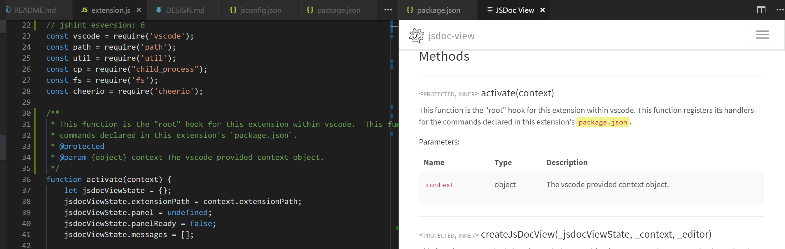

# jsdoc-view README

This extension allows a developer to view the jsdoc documentation for their current project within vscode (in a webview panel).  This extension introduces two commands--`jsdocView.start`, which will open up the jsdoc docs for this project (based on this extension's settings) and `jsdocView.generate` which will (re)generate said jsdoc documentation (again based on other settings for this extension).  If `jsdocView.start` does not find any documentation in the specified place, it will attempt to generate them (via `jsdocView.generate`, effectively).  

This version of this extension also includes an experimental feature to lookup the current word in the editor within the jsdoc documents for the project via `docstrap`'s full text search facilities... Which works as far as it goes.

## Features

- Bring up a webview within vscode to display the jsdoc documentation for the current project.
- Generate the jsdoc documentation for your project from within vscode.

## Requirements

This extension assumes the presence of the `jsdoc` module, although it doesn't call it directly.  It does attempt to generate jsdoc documentation indirectly via an npm script (by default it assumes this script is called `build-docs`, e.g. `npm run-script build-docs`).

## Extension Settings

`jsdocView.buildScript`
:   Specifies the npm script to run in order to generate the documentation.

`jsdocView.docDir`
:   The direction into which the documentation will be generated.

! jsdocView.preprocessOptions

`preprocessOptions.replaceCSP`
:   Will cause the jsdocView processor to replace the `<meta Content-Source-Policy...>` tag with one it thinks will allow more jsdoc sources to function.

`preprocessOptions.useCSPolicy`
:   The actual content policy to insert into the generated html pages which get rendered by VSCode.  Only used is `preprocessOptions.repaceCSP` is true.

`jsdocView.preprocessOptions.fixAttributePaths2`
:   This is the heart of the preprocessor's work specification, now made entirely configurable.  This setting directs the preprocessor which tags to check which attributes for paths which may need fixing.  As per heuristic analysis at this time, only schemeless relative paths are altered at this time.  This setting is an object, each field of which represents a specific rule.  Each rule allows for a short hand of `"tag-name"` as the field index.  You can also specify within the rule object itself a `tag` and `selector`.  All the attributes listed in `attrs` will be checked and replaced if matching.  You can specify for a given rule that you only want tags with specific class decorators to be modified (`ifHasClass`).  You can also specify to explicitly skip tags with a specific class (`exceptHasClass`).  The latter has precedence.  If `ifHasClass` is specified, the default inclusion is false, otherwise it is true. 

## Known Issues

Listed below are my known issues for this project.  If you have a comment, suggestion, request or other input on this project, please ask a question or leave a comment on the [vscode marketplace page for this project](https://marketplace.visualstudio.com/items?itemName=Shinworks.jsdoc-view).  If you encounter an issue, even one listed here, and would like to see it fixed, please go to the [github issues](https://github.com/Shizen/jsdoc-view/issues) tracker and file an issue.  This project is very much in an "on demand" mode.  If there is no demand, only issues which bother me sufficiently in contrast to my available time will actually get addressed.

- Better UI feedback.  This is stone age reporting :(
- Command debouncing (a brief survey shows some debouncing is in place, but I'm 65% sure it's not complete ;)
- `favicon` settings do not show up as the icon for the tab in `vscode`.  I have noticed this but not researched it.
- This extension has not been testing with any template other than docstrap & shinstrap.
- The tag "override" scheme with `preprocessOptions.fixAttributePaths2` is not actually necessary for what I originally envisioned it for, but having coded it, I'm leaving it in place for the interim, in case another use for it emerges.  In this issue, I am specifically referring to the ability to specify a `tag` and `selector` in the body of a rule.
- GetContext.  In the example I have been using, I have only one repos/project, one package.json and one set of jsdocs.  But, in `roi` for instance, I have many.  This issue here is that I should be looking for the nearest encapsulating package.json and trying to get docs from it, first (absent the more advanced topic of semantic integration).  For the purposes of this issue, this is a "by file" question.  I.e. based on the currently openned/focused file, which is the closest package.json, and open its docs, if any.  This makes settings more complicated because different packages may have different jsdoc settings for location and generation, but our workspace has only one (based on the root level workspace).  This implies that I should somehow read these settings out of the `package.json` of the nearest encapsulating project--doc generation script, doc location.  This implies to me that such settings ought to be moved into the respective project's `package.json`, with this extension holding defaults in its settings.  I could try to namespace it by module name though, which probably would work as well and involve less "corruption" of client packages.  This sounds better.  Of course, the logical extension of that pattern is to have a remote db that stores said settings for all known modules & packages, which then would be simpler if they were just stored in each project's `package.json` and now I've come full circle.
  - The selection of jsdoc source is currently very simplistic (it takes the docs for the current project).  This could be augmented to look more carefully at the governing `package.json` first.
  - Contextually bind textEditor to jsdocView (to scrollTo the relevant entry).  
      The editor context menu algorithm does this in part already, but it uses docstrap's internal "full-text search", which sucks, badly.  In general, this is a two part problem.
    1. I need to identify what semantic element I am on or near within the active text editor.  
        Currently, the closest I've gotten is that I know what word I'm on :/.  Get the semantic information is even harder, because vscode does not appear to expose any semantic information on the current document to the extension system.  With `shinzen` and the storage of the jsdoc AST in an sqlite db, this could be much more reasonably acertained.  Alternatively, with a service provider server, I could, similar to a language server, parse the file (with a peg parser, for example, for flexbility), and use the \[cached\] results to inform my identification.
    2. I need to determine which file to open for a given reference (which jsdoc file that is).
        Given the layout of jsdoc files, naming structure, etc.  This seems potentially difficult.  Specifically, I'd need an informed aliases/identifier table to know what a given label referred to in any given context.  This feels like a difficult problem outside an actual runtime, particularly for a loosy-goosey language like Javascript :).

      Now one thing I do have access to is the source ranges from jsdoc doclets as they are built.  So it is possible I could build a mapping file (similar to, but not literally the same as a debugger mapping file), to map ranges in the source code with jsdoc files.  This seems plausible.  Odds are, to get a "good" result I'm going to need a weighted montage of strategies.
- The anchor scrollTo helper function utilizes `scrollIntoView` which appears to be slightly off in its calculations, as it doesn't factor in the navbar.  This is a polyfill/patch type issue as there are many circumstances that might cause this problem, and an ideal solution would detect them and offset as appropriate.  Since I do not have an enumeration of the possible issues, it's hard to do a reasonable patch.  I am currently doing an "arbitrary" 65px offset.  I could calculate the exact cut out for the navbar for docstrap, but as I said, this doesn't feel like it would particularly map to other templates, layouts and styles.
- Preprocessing html pages for display in vscode's webview has some known issues
  - I need to verify that the path in question is relative.
  - We do not fix-up paths for non-windows platforms.
- Change configuration options
  - Allow non-npm based script for jsdoc generation
  - ? Do we need jsdoc generation options to vary by active file?  Doesn't seem like it.  (--yes, of course we do)

See also [the extensions KB](P:/_KnowledgeBase/_Applications/Visual%20Code/Extensions.md#WIP) for its extended list of WIP issues.

## Futures

- Backwards hook-in -- shim source code links to open the texteditor in the appropriate location.  THis is a very poorly worded feature idea.  What I mean is to add to the current click handler in the webview some extra logic to see if the link follows jsdoc's generated source code anchor format, and if it does, direct vscode to open that source file scrollto'd to that location.
- Service implementation -- Alter the structure of this extension to use a service which starts itself up on demand and serves the jsdoc information to the webview.  The service would shut itself down after timeout (because it can always be spun back up anyway).  This service would then be responsible for doing any preprocessing (probably much less necessary), search, etc. type patterns.
- source code references "should" be patched to open up that source line in the editor
- Look at building a `css` sheet for #2 & #3 which takes advantage of css vars and VSCode's use thereof.
		code {
		    color: var(--vscode-editor-foreground);
		} 
- Synchronize between the active source file in the text editor and the webview (not even sure that's desireable).

## Release Notes

See the [Changelog](CHANGELOG.md) for details.